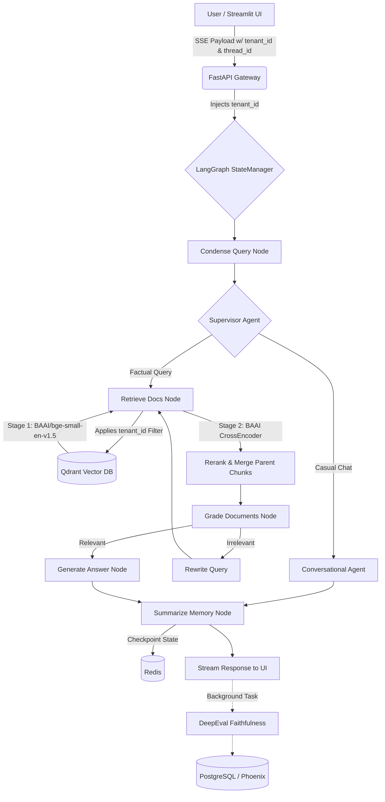

# 🤖 Enterprise Agentic RAG Pipeline - Multi-Tenant, Stateful, Observable

`rag-agent-v3` is a production-grade Retrieval-Augmented Generation (RAG) architecture designed for scalability, data security, and autonomous routing.

Built for enterprise environments, this system features hard multi-tenancy at the vector database level, persistent time-travel state management, and asynchronous telemetry.

---

## 🏗️ System Architecture & Data Flow

The following diagram illustrates the lifecycle of a user request through the multi-agent system:


---

## 🧠 Architecture Decision Records (ADRs) - The "Why"

This system implements several advanced architectural patterns to solve common RAG failure points:

**1. Hard Multi-Tenancy via Payload Filtering (Data Security)**
*   **Problem:** In a multi-user environment, Tenant A's LLM prompt might accidentally retrieve Tenant B's sensitive documents.
*   **Solution:** The system enforces a mathematical "Security Wall." A `tenant_id` is injected into the GraphState at the API gateway. Qdrant applies a strict `FieldCondition` payload filter during retrieval, ensuring 0% cross-tenant data leakage, regardless of prompt manipulation.

**2. Parent-Child Chunking Strategy (Context vs. Searchability)**
*   **Problem:** Small document chunks are great for exact-match searching, but terrible for providing the LLM enough context to answer complex questions.
*   **Solution:** Documents are ingested using a Parent-Child strategy. Qdrant indexes small 600-character "Child" chunks for high-precision semantic search. During retrieval, the engine intercepts the result, maps it to its UUID, and swaps it with the larger 3000-character "Parent" chunk before sending it to the LLM.

**3. The "Context Diet" (Rolling Buffer Memory)**
*   **Problem:** Long conversations cause the LLM context window to overflow, increasing latency and hallucination rates.
*   **Solution:** A dedicated `summarize_memory` node sits at the end of the graph. It maintains a strict "diet": only the last 4 messages are kept verbatim. Any older messages are compressed into a rolling summary paragraph by a background LLM call.

**4. Policy-Based Supervisor Routing**
*   **Problem:** Forcing all user queries through a Vector DB wastes compute and causes awkward answers to simple greetings like "Hello."
*   **Solution:** A Supervisor Agent evaluates the condensed query against strict routing policies. It routes grounded questions to the `document_agent` and casual/follow-up questions to the `conversational_agent`, bypassing the RAG pipeline entirely when unnecessary.

**5. Asynchronous Observability**
*   **Problem:** Running RAG Evaluation (DeepEval) synchronously blocks the UI, causing massive latency for the end-user.
*   **Solution:** DeepEval faithfulness checks and Arize Phoenix OpenTelemetry tracing are offloaded to FastAPI `BackgroundTasks`. The user receives their streaming response instantly, while the system grades the answer in the background and commits the trace to an ACID-compliant PostgreSQL database.

---

## 🛠️ Tech Stack & Justification

| Component | Technology | Justification |
| :--- | :--- | :--- |
| **Backend / API** | FastAPI | Async-first, high throughput, native Server-Sent Events (SSE) support. |
| **Orchestration** | LangGraph | State-machine based routing, cyclical loops, and native Redis integration. |
| **Vector Database** | Qdrant | High-performance Rust-based engine, supports hard payload filtering. |
| **Embeddings** | BAAI/bge-small-en-v1.5 | Ultra-fast, lightweight local execution optimized for English semantic search. Zero external API latency. |
| **Reranking** | BAAI/bge-reranker-base | Stage-2 CrossEncoder to maximize top-k retrieval precision. |
| **Ingestion** | Docling | Superior handling of complex PDFs, tables, and OCR compared to PyPDF. |
| **State / Memory** | Redis | High-speed, persistent key-value store for LangGraph thread checkpoints. |
| **Telemetry** | Arize Phoenix + PostgreSQL | OpenTelemetry standard, persistent trace storage across container restarts. |
| **Evaluation** | DeepEval | LLM-as-a-judge metric scoring (Faithfulness, Answer Relevance). |
| **Frontend** | Streamlit | Rapid prototyping, native chat UI components, Python-native. |

---

## 🚀 Quick Start & Deployment

### Prerequisites
*   Python 3.10+ (recommended: 3.11)
*   Docker Desktop (with Docker Compose)
*   **Ollama setup for Hybrid Architecture:** To utilize local GPU power without Docker networking bottlenecks, install Ollama directly on your host OS (Windows/Mac) and pull the model: `ollama pull llama3.1:8b`.
    *   *Windows users:* Set Environment Variables `OLLAMA_HOST=0.0.0.0` and `OLLAMA_ORIGINS=*` to allow Docker containers to access it.

Choose the setup that matches your development workflow below.

### Option A: Local Workbench Setup (Best for Active Coding)
In this mode, databases run in Docker, but your Python API and UI run directly on your host machine for easy debugging, hot-reloading, and direct file access.

1.  **Boot Infrastructure Only:**
    ```bash
    # Comment out the 'api' and 'ui' services in docker-compose.yml, then run:
    docker-compose up -d
    ```
2.  **Environment Setup:**
    ```bash
    python -m venv .venv
    source .venv/bin/activate  # On Windows: .\.venv\Scripts\Activate.ps1
    pip install -r requirements.txt
    ```
3.  **Start Services (using host machine):**
    *   Terminal 1 (Backend): `uvicorn main:app --reload --port 8080`
    *   Terminal 2 (Frontend): `streamlit run ui.py`

### Option B: Full Containerized Setup (Best for Testing/Sharing)
In this mode, everything (except Ollama) runs inside Docker networks. This guarantees environment parity across different machines.

1.  **Map Data Volumes:** Ensure the volume path for `/app/data` in `docker-compose.yml` points to your actual local documents folder.
2.  **Build and Run:**
    ```bash
    docker-compose up --build -d
    ```
3.  **Access Services:**
    *   UI: `http://localhost:8501`
    *   API Docs: `http://localhost:8080/docs`
    *   Phoenix UI: `http://localhost:6006`
    *   RedisInsight: `http://localhost:8001`

---

## 🌍 The Path to Production

This architecture is "production-ready" in its logic, but to deploy this to real-world users (AWS/GCP/Azure), the infrastructure must transition from a "local machine" paradigm to a "distributed cloud" paradigm.

### What Stays the Same (The Core Logic)
*   **LangGraph Orchestration:** The agent logic, supervisor routing, and memory summarization are fully scalable.
*   **FastAPI Backend:** FastAPI is natively production-ready (run it with Gunicorn workers in production).
*   **Multi-Tenancy Filtering:** The Qdrant payload filtering logic remains the gold standard for security.
*   **Async Telemetry:** Background tracing prevents user-facing latency.

### What Needs to Change (The Migrations)

| Component | Current Local Setup | Production Tech Stack | Why? |
| :--- | :--- | :--- | :--- |
| **LLM Inference** | Local Windows Ollama (`llama3.1:8b`) | **Cloud AI:** AWS Bedrock (Claude 3.5), Azure OpenAI, or self-hosted `vLLM` on EC2 GPU instances. | Local machines cannot handle concurrent user requests. Cloud APIs offer infinite scale; `vLLM` offers high-throughput custom hosting. |
| **Frontend UI** | Streamlit | **React / Next.js / Vue** | Streamlit is excellent for prototyping, but lacks the granular state control, custom CSS, and lightweight load required for a scalable consumer product. |
| **Vector DB** | Dockerized Qdrant | **Qdrant Cloud** or **AWS OpenSearch Serverless** | Managed databases handle automated backups, horizontal scaling, and multi-AZ redundancy. |
| **State Memory** | Dockerized Redis | **AWS ElastiCache (Redis)** or **Redis Enterprise** | Prevents state loss if the container crashes. Ensures all API nodes share the same memory pool. |
| **Telemetry** | Local Arize Phoenix container | **Datadog**, **LangSmith**, or **Managed Phoenix Cloud** | Centralized dashboards for the entire engineering team to monitor hallucination rates and agent loops in real-time. |
| **Authentication** | Hardcoded UI strings (`tenant_a`) | **OAuth 2.0 / JWT (Auth0, Cognito)** | Real users must log in. The API gateway must decode the JWT to extract the `tenant_id` securely so the user cannot spoof it. |

### Deployment Steps for Production
1.  **Container Registry:** Push the FastAPI Docker image to AWS ECR or GitHub Packages.
2.  **Orchestration:** Deploy the containers to a managed Kubernetes cluster (EKS/GKE) or Serverless Container service (AWS Fargate / Google Cloud Run).
3.  **Secrets Management:** Move all database URIs and API keys out of `.env` files and into AWS Secrets Manager or HashiCorp Vault.
4.  **Ingestion Pipeline:** Decouple the document ingestion logic. Instead of a direct API call, users upload files to an **S3 Bucket**, which triggers an event-driven Lambda function or Celery worker to run Docling and populate Qdrant in the background.

---

## 📡 API Reference

### 1. Ingest Document (Tenant Secured)
**POST** `/v2/ingest/file`
```json
{
  "file_path": "C:/absolute/path/to/document.pdf",
  "metadata": { "category": "resume" },
  "tenant_id": "tenant_a"
}
```

### 2. Chat with Agent (Tenant Secured)
**POST** `/v2/agent/chat`
```json
{
  "question": "Tell me the education details from the resume",
  "tenant_id": "tenant_a",
  "thread_id": "user_session_1"
}
```
*Returns an SSE stream yielding `type: token` and `type: metadata` events.*

### 3. Retrieve Checkpointed History
**GET** `/v2/agent/history/{thread_id}`
*Time-travels through Redis to reconstruct the full UI history based on the thread ID.*